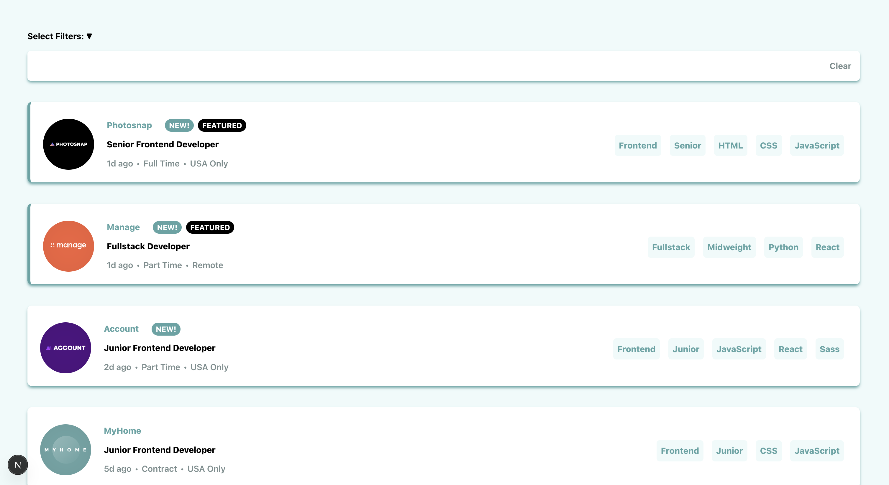

# Frontend Mentor - Job listings with filtering solution

This is a solution to the [Job listings with filtering challenge on Frontend Mentor](https://www.frontendmentor.io/challenges/job-listings-with-filtering-ivstIPCt). Frontend Mentor challenges help you improve your coding skills by building realistic projects. 

## Table of contents

- [Overview](#overview)
  - [The challenge](#the-challenge)
  - [Screenshot](#screenshot)
  - [Links](#links)
- [My process](#my-process)
  - [Built with](#built-with)
  - [What I learned](#what-i-learned)
  - [Continued development](#continued-development)
  - [Useful resources](#useful-resources)
- [Author](#author)
- [Acknowledgments](#acknowledgments)

**Note: Delete this note and update the table of contents based on what sections you keep.**

## Overview

### The challenge

Users should be able to:

- View the optimal layout for the site depending on their device's screen size
- See hover states for all interactive elements on the page
- Filter job listings based on the categories

### Screenshot



### Links

- Solution URL: [Add solution URL here](https://your-solution-url.com)
- Live Site URL: [Add live site URL here](https://static-job-listings-gamma.vercel.app/)

## My process
1. Think of the overall structure of the components
 - Macro and micro layouts for responsive design
2. Create component files based on the UI design
3. Read in data.json files and pass data through props into components
 - Top to bottom logic flow for data
4. Format mobile version using Tailwind
5. Add reactivity using JS
6. Format desktop version using media queries Tailwind

### Built with

- Semantic HTML5 markup
- CSS custom properties
- Flexbox
- CSS Grid
- Mobile-first workflow
- [React](https://reactjs.org/) - JS library
- [Next.js](https://nextjs.org/) - React framework
- [Tailwind](https://tailwindcss.com/) - For styles

**Note: These are just examples. Delete this note and replace the list above with your own choices**

### What I learned

Use this section to recap over some of your major learnings while working through this project. Writing these out and providing code samples of areas you want to highlight is a great way to reinforce your own knowledge.

To see how you can add code snippets, see below:

Learned a lot about logical flow of data in React. Great example would be filtering functionality. 

Also learned more about event handler callback functions. Passing event handlers down to child prop. Good example would be clicking a filter in filter component would pass data to parent component for direct render.

```js
  useEffect(() => {
    if (selectFilters.size === 0) {
      setDisplayJobs(defaultJob.current);
    } else {
      const filterJobs = defaultJob.current.filter((job) => {
        const jobTags = new Set([job.role, job.level, ...job.languages, ...job.tools]);
        return Array.from(selectFilters).every((selectedTag) =>
          jobTags.has(selectedTag)
        );
      });
      setDisplayJobs(filterJobs);
    }
  }, [selectFilters]);
```

If you want more help with writing markdown, we'd recommend checking out [The Markdown Guide](https://www.markdownguide.org/) to learn more.

### Continued development
I would want to continue learning more about structuring Tailwind classes in a more organized manner. Currently, code has no organized structure for deploying styles but rather smushed into individual className headers.


### Useful resources
- [React Basic Syntax](https://react.dev/learn/describing-the-ui) - Helped with learning the basic functionality of rendering data and utilizing functions.
- [CSS styling](https://developer.mozilla.org/en-US/) - Great with understanding what CSS properties do. Although its documentation for basic CSS, it is easily transferable to TailwindCSS.


## Author
- Website - [Andrew Kum](https://static-job-listings-gamma.vercel.app/)
- Frontend Mentor - [@Andee-K](https://www.frontendmentor.io/profile/Andee-K)

## Acknowledgments
Myself!
